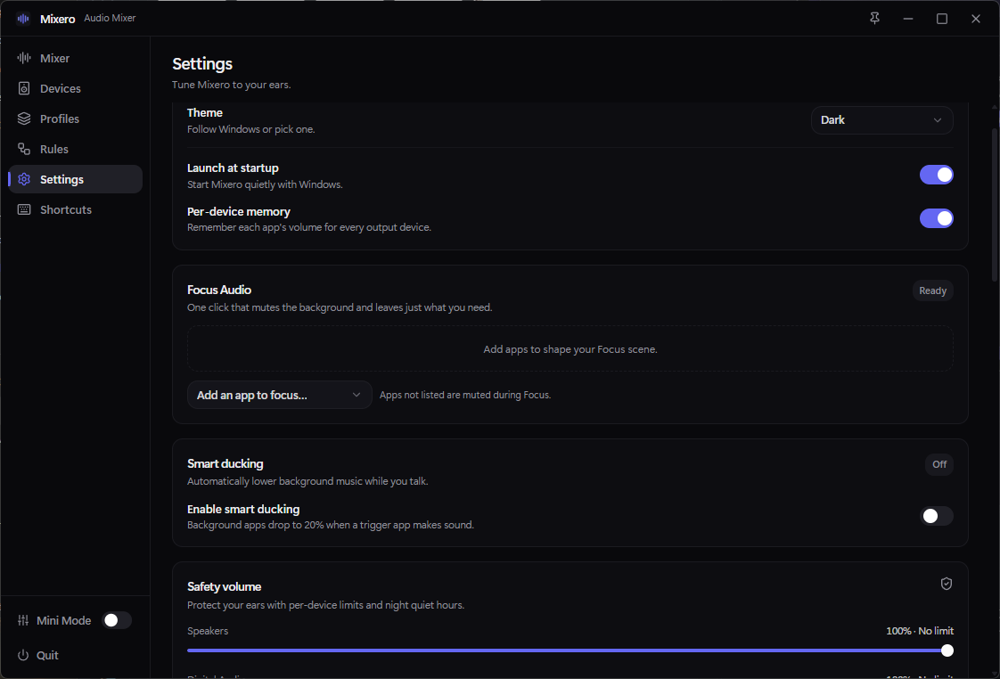

<div align="center">

# 🎚️ Mixero
### The Audio Mixer Windows 11 Always Deserved

**Control every app's volume independently, route music to speakers while gaming on your headset, and switch sound setups with a single click.**

<br />

<p align="center">
  
</p>

[](https://github.com/sajjadmrx/win11-sound-mixer/releases)
[](https://github.com/sajjadmrx/win11-sound-mixer)
[](LICENSE)

<br />

[**⬇️ Download Latest Installer**](https://github.com/sajjadmrx/win11-sound-mixer/releases/latest) • [**Report a Bug**](https://github.com/sajjadmrx/win11-sound-mixer/issues) • [**Request Feature**](https://github.com/sajjadmrx/win11-sound-mixer/issues)

</div>

---

## ✨ Why Mixero?

Windows' default volume mixer is buried in settings, clunky to use, and doesn't remember where your apps should play sound. **Mixero** brings a sleek, fast, and modern audio control center right to your desktop.

---

## 🚀 Key Features

### 1. 🎛️ Full Per-App Volume & Master Control
Adjust the volume for individual apps (like Chrome, Spotify, Discord, or games) without affecting the rest of your PC. See real-time audio visualizers to know which app is actually making noise.

<br />

---

### 2. 🔀 Route Any App to Any Audio Device
Want Spotify playing on your desk speakers while your game and voice chat stay locked to your headphones? With Mixero, you can instantly change the output device for any specific app in two clicks.

<p align="center">
  
</p>

---

### 3. 🎯 One-Click Audio Profiles
Create customized audio presets for different moments of your day. Switch instantly between **Focus mode** (quiet background, essential sounds only), **Gaming mode** (boosted voice and game levels), or **Late-night listening**.

<p align="center">
  
</p>

---

### 4. ⚡ Smart Automation & Triggers
Let Mixero do the work for you. Set automatic rules like:
- *When Discord launches → Automatically activate Game Mode.*
- *When headphones are plugged in → Switch master output.*

<p align="center">
  
</p>

---

### 5. 🛡️ Ear Safety & Smart Ducking
- **Smart Ducking:** Automatically lowers background music volume when someone is speaking on Discord or in a meeting.
- **Per-Device Volume Limits:** Prevents accidental ear-blasting when plugging in sensitive in-ear monitors.
- **Night Mode:** Keeps maximum volume capped during quiet night hours.

<p align="center">
  
</p>

---

## ⌨️ Global Shortcuts

Control your sound from anywhere, even while full-screen in a game:

| Shortcut | Action |
| :--- | :--- |
| `Ctrl + Alt + M` | Toggle compact **Mini Mode** overlay |
| `Ctrl + Alt + Up` | Increase Master Volume (+5%) |
| `Ctrl + Alt + Down` | Decrease Master Volume (-5%) |
| `Ctrl + Alt + U` | Quick Mute / Unmute |
| `Ctrl + Alt + F` | Toggle Focus Audio Scene |

*(All shortcuts can be fully customized in Settings)*

---

## 📥 How to Install

1. Go to the [**Releases Page**](https://github.com/sajjadmrx/win11-sound-mixer/releases/latest).
2. Download the `Mixero-Setup.exe` (or `.msi`) installer.
3. Run the installer and launch **Mixero**.
4. *(Optional)* Enable **"Launch on startup"** in Settings to always have fast audio controls in your system tray.

---

## 🛠️ Technical Details & Architecture *(For Developers)*

Mixero is engineered with a high-performance **Rust** backend communicating with a modern **React 19 + TypeScript + Tailwind CSS** frontend using **Tauri v2**.

- **WASAPI COM Integration:** Native low-latency audio session capture using `IAudioSessionManager2`, `ISimpleAudioVolume`, and `IAudioMeterInformation`.
- **PolicyConfig Routing:** Interacts with undocumented Windows COM interfaces (`IPolicyConfig` / `IAudioPolicyConfigFactory`) to re-route audio output streams on a per-process basis without virtual cables or kernel-mode drivers.
- **Thread Safety:** State synchronization handled via mpsc channels and atomic GUID context tagging to prevent audio feedback event loops.

```bash
# Clone the repository
git clone https://github.com/sajjadmrx/win11-sound-mixer.git
cd win11-sound-mixer

# Install frontend dependencies
npm install

# Run development server (Frontend + Rust Backend)
npm run tauri dev

# Build production binary
npm run tauri build
```

---

<div align="center">
  Made with ❤️ by <a href="https://github.com/sajjadmrx">Sajjad</a> • Distributed under the MIT License
</div>
